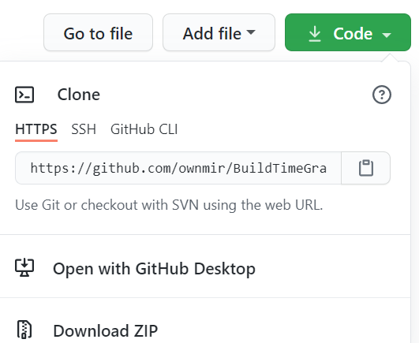

Встановлення
============

Встановити Побудову тайм-графу можна двома способами: клонувати, або завантажити.

Клонування
----------

#. Перейдіть в домашній каталог.
#. Виконайте git clone https://github.com/ownmir/BuildTimeGraph.git

Завантаження
------------

#. Перейдіть на https://github.com/ownmir/BuildTimeGraph
#. Нажміть "Code", потім "Download ZIP" (див. картинку)

	Завантаження з github

В теці downloads у вас з'явиться файл BuildTimeGraph-master.zip. Структура архіва:

* BuildTimeGraph-master
	* BTIMEG 
	* cgi-bin 
	* DOC
	* файли .py та інші 

В домашній теці створить будь-яку теку, наприклад /home/fominvv/BuildTimeGraph та скопіюйте туди всі теки та файли з BuildTimeGraph-master. Остаточна структура:

* home
	* fominvv
		* BuildTimeGraph
			* BTIMEG                      
                        * cgi-bin                   
                        * DOC                       
                        * файли .py та інші

Версія Python
=============

Щоб визначити, чи встановлений у Вас Python і яка в нього версія, наберіть в терміналі:
::

	python getver.py

Результат:
::

	Hello! Your version of python:
	
	3.8.6 (tags/v3.8.6:db45529, Sep 23 2020, 15:52:53) [MSC v.1927 64 bit (AMD64)]                                                                                    
	
	Bye!

Якщо видає помилку, чи версія 2, спробуйте так:
::

	python3 getver.py

Нема python третьої версии? Встановить, за допомогою Вашого пакетного менеджера. Якщо у Вас Windows, то загрузіть з сайту https://www.python.org/downloads/
 